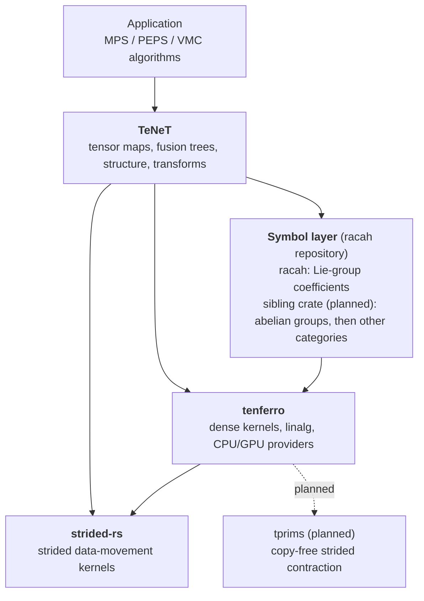
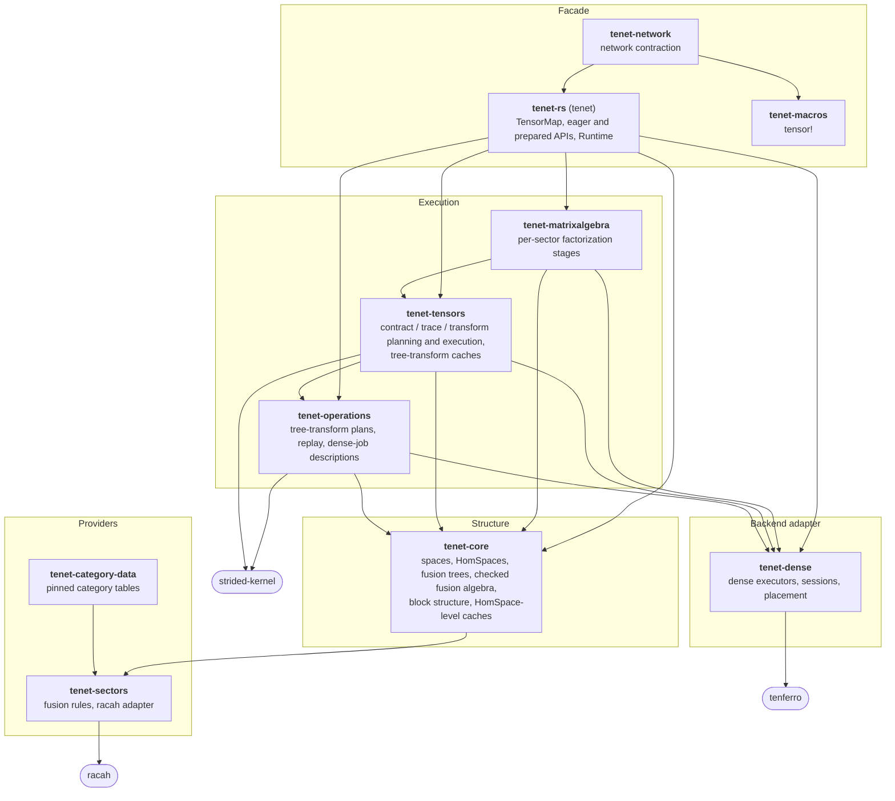

# Layering and ownership

TeNeT is one layer of a stack. Each layer owns one kind of knowledge and
reaches the next layer through a narrow interface. This document is the
authority for **which layer owns what**. Each section separates the
**target** ownership from the **current** state; the
[deviations](#current-deviations-tracked) list what still differs.

The split follows TensorKit's ecosystem:

| Concern | TensorKit ecosystem | This stack |
| --- | --- | --- |
| Elementary categorical data | WignerSymbols.jl, SUNRepresentations.jl, TensorKitSectors.jl, CategoryData.jl | `racah` (current) and a sibling crate in the racah repository (planned) |
| Symmetric tensors, fusion trees, structure, transforms | TensorKit.jl | TeNeT |
| Dense arrays, linear algebra, devices | LinearAlgebra, TensorOperations.jl | tenferro |
| Strided data movement | Strided.jl | strided-rs (`strided-kernel`) |
| Copy-free strided contraction | TBLIS via TensorOperations | tprims, inside tenferro (planned) |
| Multi-device and distributed execution | — | hataori (planned) |

## Layers



The arrows show dependency direction, and no layer depends upward.

The symbol layer uses tenferro only for the dense linear algebra of CGC
generation (`racah` `src/sun/linalg.rs` and `src/bcd/linalg.rs`, behind
`cgc-gen`). It uses no tensor or fusion-tree concept.

### 1. Symbol layer (racah repository)

**Target ownership.** For each group or category, the symbol layer owns the
elementary data a fusion category needs:
- the fusion rule and multiplicities `N^{ab}_c`;
- dimensions and the dual;
- the Frobenius–Schur phase and indicator;
- the twist;
- 3j and 6j symbols, CGC, F-symbols and R-symbols;
- the caches of that data.

It owns nothing about tensors, fusion trees as TeNeT represents them, block
structures, layouts or sector-label encodings (`SectorId`), and nothing
shaped around one consumer's call pattern.

| Crate | Owns |
| --- | --- |
| `racah` (current) | Lie-group coefficients. SU(2) symbols are exact. Behind `cgc-gen` it generates CGC, F and R: SU(N) in the SUNRepresentations gauge, and B/C/D (SO(N)/Sp(2N)) in racah's QSpace-derived sweep gauge (`docs/gauge_soN.md`). |
| sibling crate (planned, name undecided) | First scope: the abelian groups Z2, Z_N and U1 (#2016). Fermion parity is still undecided. CU(1), Fibonacci, tabulated categories and Deligne products are later candidates; they stay in TeNeT for now. |

**Target: one provider shape across crates.** Every crate should answer N,
dims, dual, FS phase and indicator, twist, F and R in the same shape, so a
consumer adapts every crate the same way.

**Current: the surface is not uniform.**
- SU(2) uses free functions (`su2_frobenius_schur`, `su2_twist`).
- SU(N) uses `Irrep` methods (`frobenius_schur_phase`, `frobenius_schur`, `twist`).
- B/C/D has the FS indicator and twist but no FS-phase API.

**Contracts.**
- **References.** Each function documents the reference `file:symbol` it
  reproduces. SU(N) follows SUNRepresentations.jl and TensorKitSectors.jl.
  B/C/D follows QSpace, because the Julia packages do not cover SO(N) or
  Sp(2N).
- **Twists.** The twist of a group irrep is exactly 1, because group braiding
  is bosonic.
- **Frobenius–Schur.** The FS *phase* is ±1 for every irrep. The FS
  *indicator* is 0 for irreps that are not self-dual. In the SUNRepresentations
  gauge the phase is −1 on some complex irreps, e.g. the SU(4) fundamental.
- **Caching.** Every tier is process-global and in-memory: SU(2) 3j, 6j and
  derived F, and under `cgc-gen` the SU(N) product, CGC and F tiers and the
  B/C/D CGC and F tiers. Today each tier evicts FIFO under its own fixed byte
  cap, set as a static partition. Moving these tiers onto a shared weighted
  cache is racah#117.
- **R is uncached by design.** Each R is one sparse join of cached CGC.
- **On-disk persistence** of expensive coefficients is a proposal (racah#106).
  Current racah documents an in-memory-only cache.
- **Cache control.** Only the **application** may reset, trim or re-budget
  these caches; a library never does (`src/cache.rs`).
- **Reproducibility.** A documented gauge fixes the coefficients. Their
  floating-point bits may differ across dense backends or thread counts,
  within tolerance.

### 2. TeNeT (this repository)

**Owns:**
- tensor maps and graded spaces;
- fusion trees and their transformations (permute, braid, transpose, bend,
  fold, repartition);
- the composition of elementary symbols into fusion-tree transformation
  coefficients, including the A/B symbols derived from F, FS and dims;
- sector and degeneracy structure, and reduced-block layout;
- contraction route planning;
- structural pack, scatter and permutation decisions;
- the caches of all of the above.

**Does not own:**
- generation or caching of elementary symbols; TeNeT only adapts them;
- dense kernels, factorization algorithms, provider or device dispatch,
  provider workspace, or the choice of dense kernel. These belong to
  tenferro, or to strided-rs for data movement.
- application schedules: MPS, PEPS, VMC or device-transfer plans.

| Crate | Owns |
| --- | --- |
| `tenet-sectors` | Fusion-rule providers and the adapter onto the symbol layer. **Rule (target):** codec and type conversion only, with no symbol math and no symbol-layer types or cache policy in its public API. Current gaps: #2015, #2016. |
| `tenet-category-data` | Pinned category tables. They are a later candidate for the symbol layer's sibling crate. |
| `tenet-core` | Spaces, HomSpaces, fusion trees, checked fusion algebra, block structure, and the HomSpace-level structure caches. |
| `tenet-operations` | Tree-transform plans, replay, and stacked/direct dense-job descriptions, with strided data movement. |
| `tenet-tensors` | Contraction, trace and transform planning and execution over reduced blocks, and the tree-transform caches. |
| `tenet-matrixalgebra` | Per-sector factorization stages over a mode-generic factor-space authority. |
| `tenet-dense` | The only adapter onto tenferro: dense executors, sessions and device placement. |
| `tenet` (`tenet-rs`) | Typed facade: `TensorMap`, the eager and prepared APIs, and `Runtime`. |
| `tenet-network`, `tenet-macros` | Network contraction and `tensor!`. |

**Target structure-layer caches.** Four caches, mirroring TensorKit's
`@cached` set at cfaa073 (#2014):
1. sector structure per HomSpace (`sectorstructure`);
2. degeneracy structure per HomSpace (`degeneracystructure`);
3. tree transformers per (dst space, src space, permutation[, levels])
   (`treetransposer` / `treebraider`);
4. fusion-tree transformation coefficients per tree key, for every
   non-Unique (Simple and Generic) fusion style (`fstranspose` / `fsbraid`).
   Unique fusion is not cached, as in TensorKit.

All four run on one byte-weighted cache wrapper with one stats API, and the
application owns clearing them. A change of degeneracy alone must still hit
caches 1 and 4.

**Current caches.**
- The process-global layout cache, intern tables and complete-HomSpace cache
  live in `tenet-core`.
- The tree-transform stores live in `tenet-tensors` and are owned by each
  `Runtime`. Each store has its own byte budget, clear and info.
- `tenet-tensors` keeps an operation-cache policy.
- There is no shared wrapper and no single stats API yet.

### 3. tenferro and strided-rs (dense backend)

**tenferro owns:**
- dense tensors and layout;
- GEMM and grouped GEMM;
- factorizations (SVD, eigh, QR, LU) through LAPACK, faer or cuSOLVER;
- device contraction (cuTENSOR now, tprims later);
- the CPU and GPU providers;
- the choice of kernel and provider, thread control, and provider workspace.

**strided-rs owns** strided data-movement kernels, such as permute and
strided copy.

**TeNeT's rule.**
- TeNeT hands tenferro whole problems: grouped or batched GEMM over reduced
  blocks, and per-sector factorizations.
- It does not select a dense kernel and does not remove a provider.
- Backend gaps are filed as tenferro issues. They are not worked around with
  TeNeT-local kernels.

## Inside TeNeT

TeNeT's crates form tiers. Arrows mean "depends on". The edges come from
`cargo metadata` (normal dependencies only).



**Rules inside TeNeT**
- Dependencies point down the tiers: facade, then execution, then structure,
  then providers. The structure tier (`tenet-core`) never depends on
  execution, dense or device code.
- Exactly one crate touches each external layer:
  - `tenet-sectors` touches the symbol layer;
  - `tenet-dense` touches tenferro;
  - strided-rs is used only where structural data movement happens
    (`tenet-operations`, `tenet-tensors`).

**One operation across the crates**

```text
contract (tenet-rs facade)
  -> admit and represent (tenet-rs, tenet-core spaces and fusion trees)
  -> plan_contract: route Core / CopyC / DynamicTree (tenet-tensors)
  -> tree-transform plan and replay for operands or output (tenet-operations, cached in tenet-tensors)
  -> grouped GEMM over reduced blocks (tenet-dense -> tenferro)

svd / qr / eigh (tenet-rs facade, one body over FusionMode)
  -> with_leg_roles and input (tenet-rs)
  -> per-family `*_from_source::<Mode>` entry and per-sector stages (tenet-matrixalgebra)
  -> per-sector factorization requests (tenet-dense -> tenferro)
  -> factor spaces published through the mode's FactorSpaceAuthority (tenet-matrixalgebra, tenet-core)
```

**Who owns which cache**

| Cache | Crate | Scope |
| --- | --- | --- |
| Layout, intern tables, complete-HomSpace structure | `tenet-core` | process-global |
| Tree-transform structures, plans and contents | `tenet-tensors` | per `Runtime` |
| Operation-cache policy | `tenet-tensors` | process-global |
| Elementary symbols (F, CGC, ...) | racah, not TeNeT | process-global |

The target is four caches behind one wrapper (#2014).

## Interfaces between layers

| From → to | Through | Shape |
| --- | --- | --- |
| TeNeT → symbol layer | `tenet-sectors` | Mathematical queries (`N`, `dims`, `dual`, FS phase, `twist`, `F`, `R`), converted into TeNeT types. |
| TeNeT → tenferro | `tenet-dense` | Grouped dense jobs and per-sector factorization requests, inside one execution context. |
| TeNeT → strided-rs | `tenet-operations`, `tenet-tensors` | Strided data-movement kernels for structural permutation, pack and scatter. |
| Symbol layer → tenferro | racah's CGC-generation modules only | Small dense SVD, QR, least squares and matmul. Errors are carried as strings. |

**Boundary rules (target).**
- **Imports.** One crate per consumer imports a given dense or symbol
  dependency. Today that holds for tenferro (only `tenet-dense`) and racah
  (only `tenet-sectors`; `tenet-tensors` tests use racah as a
  dev-dependency to reset its caches as the application would). strided-rs is used where structural data movement
  happens.
- **Public types.** A higher layer's public API exposes no type from a lower
  layer.
- **Process-global policy.** Cache reset, budgets and thread pools are set by
  the application, not by an intermediate library, unless a stated exception
  applies.
- **Version bumps.** A lower layer's version bump lands in a dedicated PR,
  with `Cargo.lock` committed and CI run with `--locked`.

## Current deviations (tracked)

- **Category symbols generated in TeNeT.** Abelian groups, CU(1), Fibonacci,
  products and `tenet-category-data` are still generated in TeNeT. The
  abelian groups move first (#2016); the rest are later candidates.
- **racah leaking through `tenet-sectors`.** It re-exports racah's cache
  module and embeds racah error types (#2015 items 2–3). The A/B default
  derivations also live there.
- **Duplicate F/R shape checks** in `tenet-sectors` and `tenet-core` (#2014).
- **Structure caches** are more than four, have no shared wrapper or stats
  API, and the transform stores are per-`Runtime` (#2014). Their per-block
  metadata is about 2× TensorKit's (#2011).
- **A tenferro type in TeNeT's public API.** `tenet-dense` re-exports
  `tenferro_cpu::CpuBackendKind`, and it reaches the facade through
  `tenet::expert` and the `Runtime` builder (`gemm_kind`).
- **Stated exception: process-global CubeCL setting.**
  `tenet-dense::cuda_adapter::context::single_cubecl_stream` sets CubeCL's
  process-wide `max_streams = 1`, which correctness requires (#1391).
